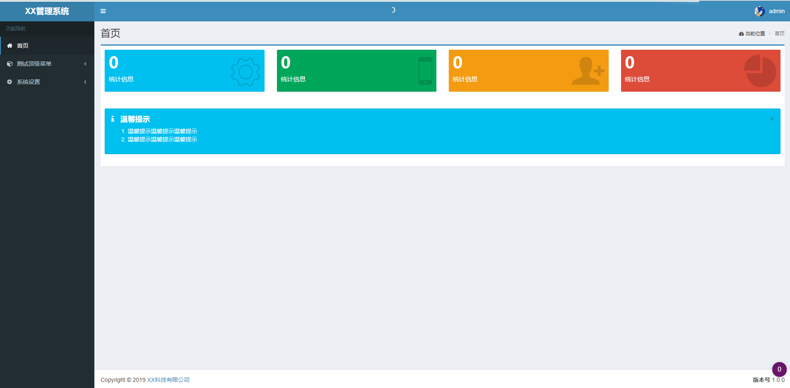

# flask_manager

基于flask的web管理框架

## 简介

flask_manager是一个基于[flask-adminlte-scaffold](https://github.com/xiiiblue/flask-adminlte-scaffold) 改进而来的简单后台管理系统。

主要将flask-adminlte-scaffold中的orm由peewe替换为sqlalchemy并精简了一些代码。



* 菜单管理功能，通过后台就可以自己添加菜单
* 个人中心，增加二次验证功能

## 安装方式

```sh
git clone https://github.com/block-cat/flask_manager.git
```

然后安装依赖:

```sh
pip install -r requirements.txt
```

## 配置文件

config.ini

## 初始化数据库

```python
python3 manage.py db init
python3 manage.py db upgrade
python3 manage.py db mirgate
```

## 初始化用户

以pg为例

```sql
insert into "user" (username,password,fullname,email,phone,status) values ('admin','pbkdf2:sha256:50000$99JpNyzo$74d2e66765e6396d626822bc80100749afd4489cc0a4fe7e8e97394f1801e996','admin','admin@123.com','123','t');
```

## 启动

```python
python __init__.py
```

## 通用管理后台

快速创建可以编辑查询的数据模型

### 创建模型

1. 首先在model文件夹下创建model文件，在__init__.py文件中引入。
2. models的定义中添加__routename__用于指定路由前缀（需要使用通用管理模型的类使用，不适用通用管理模型的类可以不添加）

### 创建表单

1. 在main文件夹下创建与前面创建模型对应的表单，并使用同样的__routename__指定路由
2. 在views文件中，引入数据模型

### 手动创建菜单

启动系统后，在菜单管理中，手动创建菜单